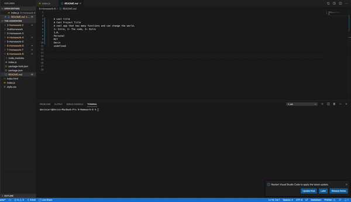

# 8-Homework-8
## My Steps
### First I created a index.js
### Then I npm init and npm install inquirer

### Then I started coding
### I Called inquirer, fs, util.

### Then I created a function that prompted the user with there input.

### Then I put the users inputs into Answers and had them displayed.

### Then I called the PrompUser function and added 2 .then functions and 1 .catch.

### After user inputs answers, he gets his own custom README file!

## Extra Images and GIF 

  
    
    
